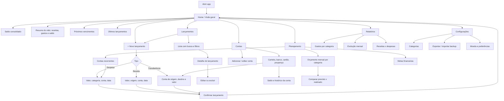

# Fluxo de telas — gestão financeira pessoal

Este documento registra o fluxo inicial do aplicativo, sem autenticação e com
os dados mantidos localmente no dispositivo.

## Escopo inicial sugerido

1. Home com saldo, resumo mensal, vencimentos e acesso ao lançamento rápido.
2. Lançamentos de receita, despesa e transferência.
3. Contas e categorias.
4. Contas recorrentes.
5. Relatórios e metas como evolução posterior.
